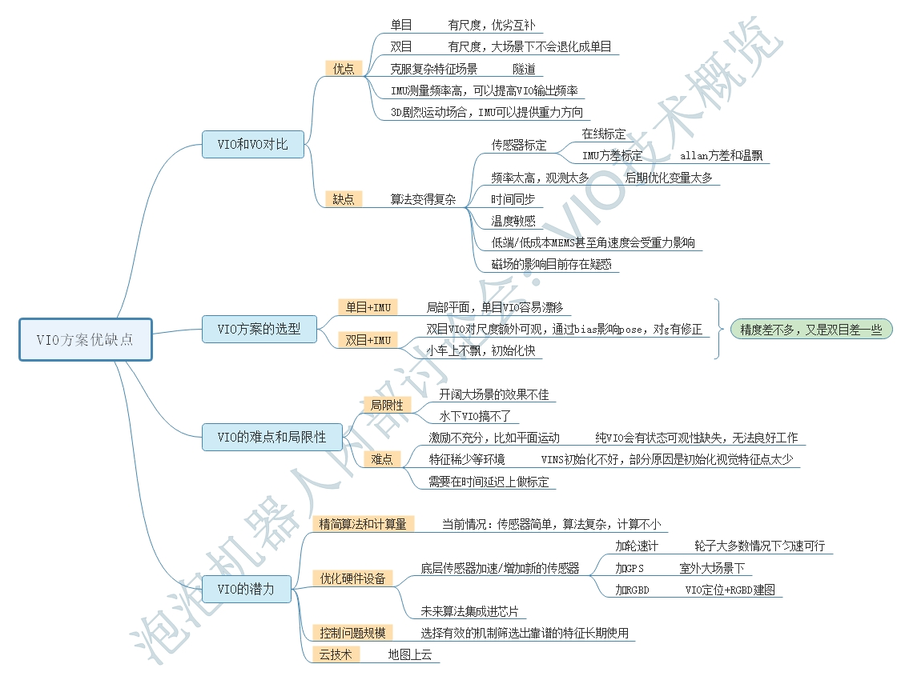

# 主题：VIO技术概览

## 思维导图

 

## 具体讨论内容

### 1. VIO相比VO（单目、双目和RGBD）好处和坏处在哪？

#### 1.1 引入IMU的好处和潜在缺陷，例如引入IMU新增哪些可用信息，引入IMU不会增加哪些负担，IMU会受哪些因素影响，IMU会增加哪些负担
- 好处：
  - 和单目 最好的是有尺度 且优劣互补；
  - 和双目应该也算是有尺度，双目在大场景下会退化成单目；
  - IMU测量频率高 可以提高VIO的输出频率；
  - 对于3d剧烈运动的场合，imu可以提供重力方向；
  - 克服重复特征场景，比如隧道等；
- 坏处：
  - 算法变得复杂；
  - 传感器标定，在线标定；
  - 时间同步，对温度敏感；
  - 低端mems甚至角速度会受重力影响；
  - 因为频率太高 观测太多 后期优化变量太多
  - 磁场的影响目前存在疑惑？？？？？(电容的不会受影响，mems的会受影响)

### 2. 一般vio方案用单目还是双目？
#### 2.1  为何VI-ORB SLAM和VINS-Fusion中，双目+IMU会比单目+IMU要差？

- 局部平面，单目VIO容易漂移，双目VIO对尺度额外可观，然后传递到bias里面，再传递到姿态里面，于是对g有修正。
- 双目vio精度 和 单目vio单目差不多，或有时候差一些。 双目的好处是 小车上不飘， 初始化快。
- VINS-Fusion的双目+imu初始化其实用的就是双目初始化，g没做对齐？？？？
- IMU方差标定：allan方差和温飘
 

### 3. vio目前的难点、局限性？

#### 3.1  难点可能是指目前难以解决的已知问题，可能需要结合大家目前的研究方向来讨论，因为研究方向通常是需要解决的难点

#### 3.2  局限性可能是指无法使用的场景，可能需要结合camera或imu无法使用或者效果不好的场景讨论

- 局限：
  - 开阔大场景的效果不佳；
  - 水下VIO搞不了；
- 难点：
  - 激励不充分时（比如平面运动），纯vio会有状态可观性缺失，无法良好工作；
  - 特征稀少和平面等环境，虽然理论上imu可以支持，但是实际上目前还是个痛点(VINS初始化不好，部分原因是初始化时视觉特征点太少)；
  - 需要在时间延迟上做标定；

### 4. vio还有哪些潜力可以挖掘？有哪些可能提高当前VIO方法的策略？

#### 4.1 轻量级：计算平台，速度与精度的折中，能耗，输出频率**

- 传感器简单，算法复杂，计算不小；
- 底层硬件加速，或者可以有有效的机制筛选出靠谱的特征长期使用，控制优化问题规模，或者增加新的传感器；
- 未来算法可能会进入芯片，地图会上云；

#### 4.2 与其他传感器结合（分应用讨论）：轮式里程计？GPS？结构光？TOF？

- 加轮子，轮子大多数情况下匀速可行；
- 场景大了就该上GPS；
- VIO+RGBD建图更给力；

 

 

 